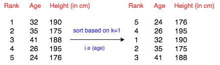

# 13.Python Built-Ins Athelete Sort

You are given a spreadsheet that contains a list of  athletes and their details (such as age, height, weight and so on). You are required to sort the data based on the th attribute and print the final resulting table. Follow the example given below for better understanding.



Note that  is indexed from  to , where  is the number of attributes.

Note: If two attributes are the same for different rows, for example, if two atheletes are of the same age, print the row that appeared first in the input.

Input Format

The first line contains  and  separated by a space. 
The next  lines each contain  elements. 
The last line contains .

Constraints

Each element 

Output Format

Print the  lines of the sorted table. Each line should contain the space separated elements. Check the sample below for clarity.

Sample Input 0

    5 3
    10 2 5
    7 1 0
    9 9 9
    1 23 12
    6 5 9
    1

Sample Output 0

    7 1 0
    10 2 5
    6 5 9
    9 9 9
    1 23 12

Explanation 0

The details are sorted based on the second attribute, since  is zero-indexed.

## Python lamda()函数

1、lambda是什么？

 看个例子： 

    1 g = lambda x:x+1

 看一下执行的结果： 

 g(1)

 \>\>\>2

 g(2)

 \>\>\>3

 当然，你也可以这样使用：

 lambda x:x+1(1)

 \>\>\>2 

 可以这样认为,lambda作为一个表达式，定义了一个匿名函数，上例的代码x为入口参数，x+1为函数体，用函数来表示为：

    1 def g(x):
    2     return x+1

 非常容易理解，在这里lambda简化了函数定义的书写形式。是代码更为简洁，但是使用函数的定义方式更为直观，易理解。

 Python中，也有几个定义好的全局函数方便使用的，filter, map, reduce 

    >>> foo = [2, 18, 9, 22, 17, 24, 8, 12, 27]
    >>>
    >>> print filter(lambda x: x % 3 == 0, foo)
    [18, 9, 24, 12, 27]
    >>>
    >>> print map(lambda x: x * 2 + 10, foo)
    [14, 46, 28, 54, 44, 58, 26, 34, 64]
    >>>
    >>> print reduce(lambda x, y: x + y, foo)
    139


 上面例子中的map的作用，非常简单清晰。但是，Python是否非要使用lambda才能做到这样的简洁程度呢？在对象遍历处理方面，其实Python的for..in..if语法已经很强大，并且在易读上胜过了lambda。

 比如上面map的例子，可以写成：

 print [x \* 2 + 10 for x in foo]

 非常的简洁，易懂。

 filter的例子可以写成：

 print [x for x in foo if x % 3 == 0]

 同样也是比lambda的方式更容易理解。

---

 上面简要介绍了什么是lambda,下面介绍为什么使用lambda,看一个例子（来自apihelper.py)： 

    processFunc = collapse and (lambda s: " ".join(s.split())) or (lambda s: s)

 在Visual Basic，你很有可能要创建一个函数，接受一个字符串参数和一个 *collapse* 参数，并使用 if 语句确定是否压缩空白，然后再返回相应的值。这种方式是低效的，因为函数可能需要处理每一种可能的情况。每次你调用它，它将不得不在给出你所想要的东西之前，判断是否要压缩空白。在 Python 中，你可以将决策逻辑拿到函数外面，而定义一个裁减过的 lambda 函数提供确切的 (唯一的) 你想要的。这种方式更为高效、更为优雅，而且很少引起那些令人讨厌 (哦，想到那些参数就头昏) 的错误。

 通过此例子，我们发现，lambda的使用大量简化了代码，使代码简练清晰。但是值得注意的是，这会在一定程度上降低代码的可读性。如果不是非常熟悉python的人或许会对此感到不可理解。

---

 lambda 定义了一个匿名函数

 lambda 并不会带来程序运行效率的提高，只会使代码更简洁。

 如果可以使用for...in...if来完成的，坚决不用lambda。

 如果使用lambda，lambda内不要包含循环，如果有，我宁愿定义函数来完成，使代码获得可重用性和更好的可读性。


 总结：lambda 是为了减少单行函数的定义而存在的。

```python
#!/bin/python
# Very excellent solution! Try more questions using lamda()
import math
import os
import random
import re
import sys

if __name__ == '__main__':
    N, M = map(int, input().split())
    rows = [input() for _ in range(N)]
    K = int(input())

    for row in sorted(rows, key=lambda row: int(row.split()[K])):
        print(row)
```