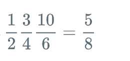

# 28. Python Reduce Function（分数运算）

语法
--

reduce() 函数语法：

    reduce(function, iterable[, initializer])

参数
--

* function -- 函数，有两个参数
* iterable -- 可迭代对象
* initializer -- 可选，初始参数

返回值
---

返回函数计算结果。

实例
--

以下实例展示了 reduce( ) 的使用方法：

\>\>\>def add(x, y) : \# 两数相加 ... return x + y ... \>\>\> reduce(add, [1,2,3,4,5]) \# 计算列表和：1+2+3+4+5 15 \>\>\> reduce(lambda x, y: x+y, [1,2,3,4,5]) \# 使用 lambda 匿名函数 15

---

---

Given a list of rational numbers,find their product.

**Concept** 
The `reduce()` function applies a function of two arguments cumulatively on a list of objects in succession from left to right to reduce it to one value. Say you have a list, say `[1,2,3]` and you have to find its sum.

    \>\>\> reduce(lambda x, y : x + y,[1,2,3])
    6

You can also define an initial value. If it is specified, the function will assume initial value as the value given, and then reduce. It is equivalent to adding the initial value at the beginning of the list. For example:

    \>\>\> reduce(lambda x, y : x + y, [1,2,3], -3)
    3

    \>\>\> from fractions import gcd
    \>\>\> reduce(gcd, [2,4,8], 3)
    1

**Input Format**

First line contains , the number of rational numbers. 
The  of next  lines contain two integers each, the numerator(  ) and denominator(  ) of the  rational number in the list.

**Constraints**

* 
* 

**Output Format**

Print only one line containing the numerator and denominator of the product of the numbers in the list in its simplest form, i.e. numerator and denominator have no common divisor other than .

**Sample Input 0**

    3
    1 2
    3 4
    10 6

**Sample Output 0**

    5 8

**Explanation 0**

Required product is 

```python
from fractions import Fraction
from functools import reduce
import operator
def product(fracs):
    #t = # complete this line with a reduce statement
    #fracs1=[]
    #for i in range(len(fracs)):
    t =  reduce(operator.mul , fracs) # complete this line with a reduce statement
    return t.numerator, t.denominator

if __name__ == '__main__':
    fracs = []
    for _ in range(int(input())):
        fracs.append(Fraction(*map(int, input().split())))
    result = product(fracs)
    print(*result)
```

