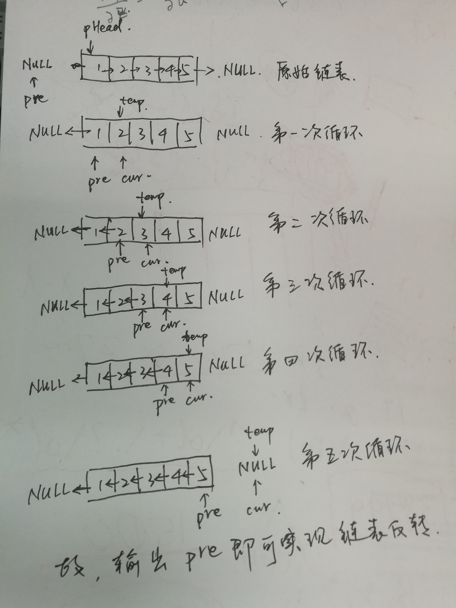

# 15. 反转链表（链表）

题目描述
----

输入一个链表，反转链表后，输出新链表的表头。



```python
# -*- coding:utf-8 -*-
class ListNode:
    def __init__(self, x):
        self.val = x
        self.next = None
class Solution:
    # 返回ListNode
    # 这道题目很基础，我还是没写起来，看一下桌面上那个画的示意图！！！
    def ReverseList(self, pHead):
        # write code here
        if pHead==None or pHead.next==None:
            return pHead
        # pre和cur是两个标记指针，一前一后
        pre = None # 前面的指针
        cur = pHead #后面的指针
        while cur!=None:
            tmp = cur.next# 标志cur后面的指针
            cur.next = pre # 标志cur前面的指针
            pre = cur # 指针向后移动
            cur = tmp # 指针向后移动
        return pre
            
```