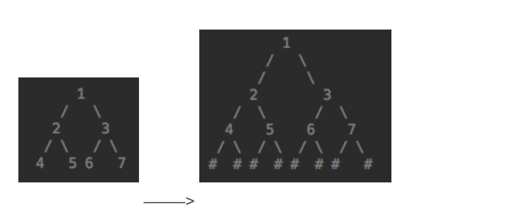

# 61. 序列化二叉树（树）

题目描述
----

请实现两个函数，分别用来序列化和反序列化二叉树

解题思路

序列化二叉树：把一棵二叉树按照某种遍历方式的结果以某种格式保存为字符串。需要注意的是，序列化二叉树的过程中，如果遇到空节点，需要以某种符号（这里用\#）表示。以下图二叉树为例，序列化二叉树时，需要将空节点也存入字符串中。 

 ——–\> 

序列化可以基于先序/中序/后序/按层等遍历方式进行，这里采用先序遍历的方式实现，字符串之间用 “，”隔开。代码如下：



```python
def Serialize(self, root):
    if not root:
        return '#'
    return str(root.val) +',' + self.Serialize(root.left) +','+ self.Serialize(root.right)
'''
反序列化二叉树：根据某种遍历顺序得到的序列化字符串，重构二叉树。具体思路是按前序遍历"根左右"的顺序，根节点位于其左右子节点的前面，即非空（#）的第一个节点是某子树的根节点，左右子节点在该根节点后，以空节点#为分隔符。代码如下：
'''
def Deserialize(self, s):
    list = s.split(',')
    return self.deserializeTree(list)

def deserializeTree(self, list):
    if len(list)<=0:
        return None
    val = list.pop(0)
    root = None
    if val != '#':
        root = TreeNode(int(val))
        root.left = self.deserializeTree(list)
        root.right = self.deserializeTree(list)
    return root

```

```python
# -*- coding:utf-8 -*-
class TreeNode:
    def __init__(self, x):
        self.val = x
        self.left = None
        self.right = None
# 没有看懂，研究别人的代码！！！
# 见收藏夹里的一个CSDN博客

class Solution:
    def Serialize(self, root):
        """前序递归"""
        ret = []
        if not root:
            return '#'
        ret.append(str(root.val))
        l = self.Serialize(root.left)
        ret.append(l)
        r = self.Serialize(root.right)
        ret.append(r)
        return ','.join(ret)
     
    def Serialize_no_rec(self, root):
        """前序非递归"""
        serialize_str = []
        if not root:
            return '#'
        s = []
        while root or s:
            while root:
                # serialize_str += (str(root.val)+',')
                serialize_str.append(str(root.val))
                s.append(root.right)  # 栈中存放右结点，便于左子树访问完之后回溯
                root = root.left
            # serialize_str += "#,"
            serialize_str.append('#')  # 左结点访问完，用＃来标识该结点的空指针
            root = s.pop()  # 依次访问栈中的右子树  # print serialize_str
        return ','.join(serialize_str)
    

    def Deserialize(self, s):
        serialize = s.split(',')
        tree, sp = self.deserialize(serialize, 0)
        return tree
    
    def deserialize(self, s, sp):
        if sp >= len(s) or s[sp] == "#":
            return None, sp + 1
        node = TreeNode(int(s[sp]))
        sp += 1
        node.left, sp = self.deserialize(s, sp)
        node.right, sp = self.deserialize(s, sp)
        return node, sp


```